# Usage

The core function in *VarianceComponentTest.jl* is *gwasvctest*, which wraps the three types of exact tests. The usage for *gwasvctest* is

```julia
gwasvctest(Name = Value)
```

Where `Name` is the option name and `Value` is the value of the corresponding option. Note that it's okay if `Value` is not provided since every option has a default value.

There are two ways to call *gwasvctest*

* Open up Julia and type

```julia
julia> using VarianceComponentTest
julia> gwasvctest(Name = Value)
```

* From command line, type

```
$ julia -E 'using VarianceComponentTest; gwasvctest(Name = Value)'
```

---
## Background

Consider a standard linear mixed model

<a href="url"></a>

where <a href="url">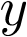</a> is a vector of quantitative phenotype, <a href="url">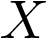</a> is covariate matrix, <a href="url">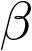</a> is a vector of fixed effects, <a href="url"></a> is genotype matrix for *m* genetic variants, <a href="url">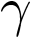</a> is their effects and follows an normal distribution with variance <a href="url">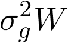</a>, W is prespecified diagonal weight matrix for the genetic variants, <a href="url">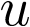</a> is vector of random effects included to control familial or structural correlation in the sample, and <a href="url">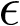</a> is vector for the error. <a href="url">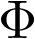</a> is the theoretical kinship matrix or estimated relationship matrix by whole-genome genotypes. <a href="url">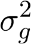</a>, <a href="url">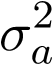</a> and <a href="url">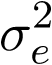</a> are corresponding variance component parameters from SNP-Set, additive genetic and environmental effects. Therefore,

<a href="url">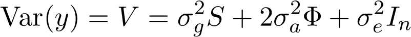</a>

where <a href="url">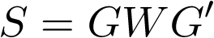</a> is the kernel matrix capturing effects from the SNP set. This software is designed to test <a href="url">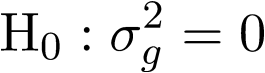</a> v.s. <a href="url">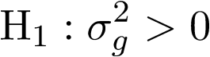</a>. For unrelated sample, <a href="url"></a> is zero, thus the model reduce to

<a href="url">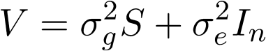</a>

The detailed descriptions of our algorithms and implementations are ??? add manuscript here ???.

---
## Specify input PLINK files

Option `plinkFile` indicates the file name (without extension) for the input PLINK files. All three PLINK files have the same file name but different extensions. Make sure the three PLINK files are at the same directory.

If the three PLINK files are *plink.bed*, *plink.bim* and *plink.fam*, then use

```julia
gwasvctest(plinkFile = "/PATH/OF/plink")
```

Replace "/PATH/OF/" with the actual path of PLINK files.

---
## Specify input covariates file

Option `covFile` indicates the file name for the input covariates file. If the covariates file is *covariates.txt*, then use

```julia
gwasvctest(covFile = "/PATH/OF/covariates.txt")
```

If option `covFile` is not specified, the covariates matrix **X** will be automatically set to a *n*-by-1 matrix with all elements equal to 1, where *n* is the number of individuals.

---
## Specify input trait file

Option `traitFile` indicates the file name for the input trait file. If the trait file is *y.txt*, then use

```julia
gwasvctest(traitFile = "/PATH/OF/y.txt")
```

If option `traitFile` is not specified, the response vector **y** will be set automatically to the phenotypes obtained from the **.fam** PLINK file.

---
## Specify input annotation file

Option `annotationFile` indicates the file name for the input annotation file. If the annotation file is *annotation.txt*, then use

```julia
gwasvctest(annotationFile = "/PATH/OF/annotation.txt")
```

---
## Specify output file

Option `outFile` indicates the file name for the output file. If the output file name is set to *test.out*, then use

```julia
gwasvctest(outFile = "/PATH/OF/test.out")
```

Replace "/PATH/OF/" with the path where you want to store the output file. If option `outFile` is not specified, the output file name will be set to *plinkFile-julia.out* and it will be stored at the current directory.

---
## Choose testing scheme

*ExactVarianceComponentTest.jl* provides three types of exact tests: exact likelihood ratio test (eLRT), exact restricted likelihood ratio test (eRLRT) and exact score test (eScore). Option `test` indicates which testing scheme you want to perform. The usage is

* `gwasvctest(test = "eLRT")`: perform exact likelihood ratio test
* `gwasvctest(test = "eRLRT")`: perform exact restricted likelihood ratio test
* `gwasvctest(test = "eScore")`: perform exact score test

The default value for option `test` is *eRLRT*.

---
## Choose method for computing p-value

Option `pvalueComputing` indicates which method will be used to obtain the p-value under null hypothesis. The usage is

* `gwasvctest(pvalueComputing = "MonteCarlo")`: use a Monte Carlo method by generating many replicates to obtain the exact null distribution of test statistic and then compute the p-value.
* `gwasvctest(pvalueComputing = "chi2")`: use a mixed Chi squared distribution to approximate the null distribution of test statistic and then compute the p-value.

The default value for option `pvalueComputing` is *chi2*. The approximation effect of mixed Chi squared distribution has been showed to be good enough, and such approximation will be faster than Monte Carlo method since much less replicates need to be generated. So please use *chi2* whenever possible.

**Note**:

1. Option `pvalueComputing` is only valid for eLRT and eRLRT, since this software employs the method of inverting characteristics function to compute the p-value for eScore.
2. In the approximation method, the exact null distributions of eLRT and eRLRT are approximated by a mixture of form <a href="url">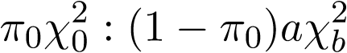</a>, where the point mass <a href="url">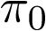</a> at 0, scale parameter <a href="url">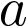</a>, and the degree of freedom <a href="url">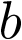</a> for the chi-squared distribution need to be determined for each SNP-set. First, estimate <a href="url"></a> by generating B replicates (the number of replicates B is specified by option `nNullSimPts`), and then estimate <a href="url"></a> and <a href="url"></a> using only a small number (300 by default) of replicates.

---
## Choose number of replicates to generate for obtaining null distribution of test statistic and p-value

Option `nNullSimPts` lets you to decide how many replicates to generate for obtaining null distribution of test statistic and p-value.

* For `pvalueComputing = "MonteCarlo"`, the more replicates to generate, the more precise the p-value will be (smaller standard error)
* For `pvalueComputing = "chi2"`, the number of replicates does not matter too much, it only effect the estimate of point mass <a href="url"></a> at 0 for test statistic

`nNullSimPts` should take positive integer, and the default value is 10,000.

**Note**: Option `nNullSimPts` is only valid for eLRT and eRLRT.

---
## Choose method for computing kinship matrix

Option `kinship` indicates how to obtain the kinship matrix <a href="url"></a>. The usage is

* `gwasvctest(kinship = "none")`: Not include kinship matrix <a href="url"></a> in the model, which means there are two terms in the variance structure of response: SNP-set effect and random environmental effect.
* `gwasvctest(kinship = "GRM")`: compute kinship matrix <a href="url"></a> by genetic relationship matrix (GRM). The algorithm is provided in section 2.3 by [*Zhou et al.*](http://arxiv.org/pdf/1407.8253v2.pdf)
* `gwasvctest(kinship = "MoM")`: compute kinship matrix <a href="url"></a> by method of moments (MoM). The algorithm is provided in section 2.3 by [*Zhou et al.*](http://arxiv.org/pdf/1407.8253v2.pdf)
* `gwasvctest(kinship = "theoretical")`: compute kinship matrix <a href="url"></a> theoretically.
* `gwasvctest(kinship = "FILE")`: replace *FILE* with the file name in which store your own pre-calculated kinship matrix <a href="url"></a>.

The default value for option `kinship` is *GRM*.

---
## Choose weights for SNP-set effect

Option `snpWtType` indicates the diagonal elements for the diagonal weight matrix W for each SNP-set. The usage is

* `gwasvctest(snpWtType = "")`: Constant weights, *i.e.*, set all weights to 1
* `gwasvctest(snpWtType = "beta")`: Beta weights, *i.e.*, set the weights by a beta distribution Beta(1, 25) evaluated at MAF for each SNP
* `gwasvctest(snpWtType = "invvar")`: Inverse variance weights, *i.e.*, set the weights by inverse variance 1/sqrt(MAF*(1-MAF))

The default value for option `snpWtType` is empty.

---
## Choose method for computing kernel matrix

Option `kernel` indicates how to obtain kernel matrix <a href="url">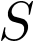</a>. The usage is

* `gwasvctest(kernel = "GRM")`: compute kernel matrix <a href="url"></a> by genetic relationship matrix (GRM), *i.e.* <a href="url">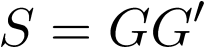</a>, where <a href="url"></a> is genotype matrix.
* `gwasvctest(kernel = "IBS1")`: compute kernel matrix by *IBS1*.
* `gwasvctest(kernel = "IBS2")`: compute kernel matrix by *IBS2*.
* `gwasvctest(kernel = "IBS3")`: compute kernel matrix by *IBS3*.

The default value for option `kernel` is *GRM*.

The standard IBS kernel values are showed in following tables

Table 1: IBS1 Kernel Values    ||   Table 2: IBS2 Kernel Values    ||   Table 3: IBS3 Kernel Values

|i/j     | 1/1 | 1/2 | 2/2 |   ||   |i/j     | 1/1 | 1/2 | 2/2 |   ||   |i/j     | 1/1 | 1/2 | 2/2 |
|:-------|:----|:----|:----|   ||   |:-------|:----|:----|:----|   ||   |:-------|:----|:----|:----|
|**1/1** | 1   | 0.5 | 0   |   ||   |**1/1** | 0.5 | 0.5 | 0   |   ||   |**1/1** | 1   | 0.5 | 0   |
|**1/2** | 0.5 | 0.5 | 0.5 |   ||   |**1/2** | 0.5 | 1   | 0.5 |   ||   |**1/2** | 0.5 | 1   | 0.5 |
|**2/2** | 0   | 0.5 | 1   |   ||   |**2/2** | 0   | 0.5 | 0.5 |   ||   |**2/2** | 0   | 0.5 | 1   |

where *i* and *j* indicate two individuals. The IBS kernels are determined by

<a href="url">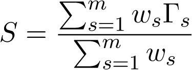</a>

where *w*'s are the weights for the *m* SNPs, <a href="url">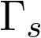</a> is the covariance matrix depending only on the genotypes at SNP *s*. The values of <a href="url"></a> are read from the above three tables.

---
## Determine the rank used to approximate the kinship matrix

In our algorithm, we do a low rank approximation of kinship matrix <a href="url"></a> to reduce the multiple variances components testing problem to two variance components problem. However, there is a trade-off for choosing the rank for approximating: if the rank is high, then a better approximation can be obtained, but a high rank will lead to a small signal-to-noise ratio, which will decrease the power of test.

Option `infLambda` provides a way to control such trade-off. Theoretically, `infLambda` can take any real value. If `infLambda` takes non positive value, then the algorithm will take the highest possible approximating rank. If `infLambda` takes a positive value, the algorithm will take a smaller approximating rank, and the larger the value is, the smaller the approximating rank will be. The default value is 0.

For example, want to take the highest rank, then

```julia
gwasvctest(infLambda = 0.0)
```

**Note**: If you are analyzing unrelated data, you can ignore option `infLambda` since the kinship matrix will not be included in the model in unrelated case.

---
## Determine the group size for each SNP set

Option `windowSize` determines the group size of a SNP set for which you want to test. It can only take positive integer. The default value is 50.

For example, want to set the group size to 60, then

```julia
gwasvctest(windowSize = 60)
```

Note that if annotation file is provided, the group size will be determined automatically, so you don't need to specify `windowSize` in that case.

---
## Parallelization

Modern computer has multiple cores usually. So you can take advantage of the parallel computing mode provided by this package

```julia
julia> addprocs(n)
julia> using VarianceComponentTest
julia> gwasvctest(Name = Value)
```

where *n* is the number of working processes which are employed to perform the computations. Usually, *n* is the number of cores your machine has.

You can also active the parallel mode from command line

```
$ julia -p n -E 'using VarianceComponentTest; gwasvctest(Name = Value)'
```

where *n* has the same meaning as above.

A concrete example is provided at the Example part.

**Note**: In Linux system, you can use the following shell command to count the number of cores on your CPU

```
$ cat /proc/cpuinfo | grep processor | wc -l
```
